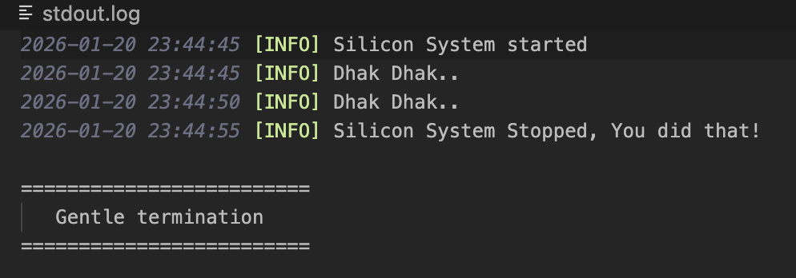

# Silicon (Phase 1)

Minimal, production-oriented macOS background system agent in C++17.  
Phase 1 logs heartbeat messages every 5 seconds, supports graceful shutdown via signals, and auto-terminates after a bounded runtime to avoid runaway agents during development.

## Features

- Thread-safe file logging  
- Heartbeat every 5 seconds  
- Graceful shutdown on signals  
- Auto stop after 1 minute (dev safety)  
- launchd-compatible agent lifecycle  

## Structure

```bash

SILICON/
│
├── bridge/                 # Obj-C++ macOS bindings (future)
│
├── build/                  # CMake build output
│
├── collectors/             # System data collectors (future: process, file, cpu, net)
│
├── core/
│   └── agent.cpp           # Main agent loop, signals, lifecycle control
│
├── docs/                   # Architecture, permissions, design notes
│
├── installer/
│   └── com.nagrajmg.silicon.plist   # launchd LaunchAgent definition
│
├── logging/
│   ├── logger.cpp          # Thread-safe file logger implementation
│   └── logger.hpp          # Logger interface
│
├── logs/
│   ├── stdout.log          # launchd stdout redirection
│   └── stderr.log          # launchd stderr redirection
│
├── Plots/
│   └── Phase1/
│       ├── outsider_kill.png    # External kill behavior visualization
│       └── system_message.png   # Graceful shutdown and system messages
│
├── READMES/
│   └── Phase1.md           # Phase 1 documentation
│
├── rules/                  # Detection / policy rules (future)
│
├── .gitignore              # Git ignore rules
│
└── CMakeLists.txt          # Build system configuration
```

--- 

## Build (CMake)

```bash

mkdir -p build

cmake -S . -B build
cmake --build build

```

The output binary is: `build/SILICON`

## Run manually

```bash

./build/SILICON

```

### Runtime Behavior

1) Logs a heartbeat every 5 seconds.
2) Automatically stops after 1 minute (development safety).
3) Prints a graceful termination banner on shutdown.

---

### Gentle Termination of the process

1) SIGQUIT (control + \\ )
2) SIGINT  (control + C)
3) Send SIGTERM if you can.

--- 

### Example of SIGQUIT / SIGINT / SIGTERM

This plot shows how Silicon behaves when terminated externally.

<p align="center">
  
</p>

### System Message

This plot captures detection of Background Agent – Silicon.

<p align="center">
  
</p>

---

## Run with launchd

1) Update the path in the plist to your absolute binary location:

- [installer/com.nagrajmg.silicon.plist](../installer/com.nagrajmg.silicon.plist)

2) Copy the plist in the LaunchAgents:

```bash

cp installer/com.nagrajmg.silicon.plist ~/Library/LaunchAgents/

```

3) Load and start the agent:

```bash

launchctl load -w ~/Library/LaunchAgents/com.nagrajmg.silicon.plist

```

4) Unload and stop the agent:

```bash

launchctl unload -w ~/Library/LaunchAgents/com.nagrajmg.silicon.plist

```

### Checks

```bash

launchctl list | grep silicon

```
This returns the job identifier and confirms the agent is active.

---

## Development Safety

Silicon auto-terminates after 1 minute in Phase 1 to prevent:

1) Runaway agents
2) Infinite restart loops under launchd
3) Resource leaks during early development

This will be removed or made configurable in later phases.
